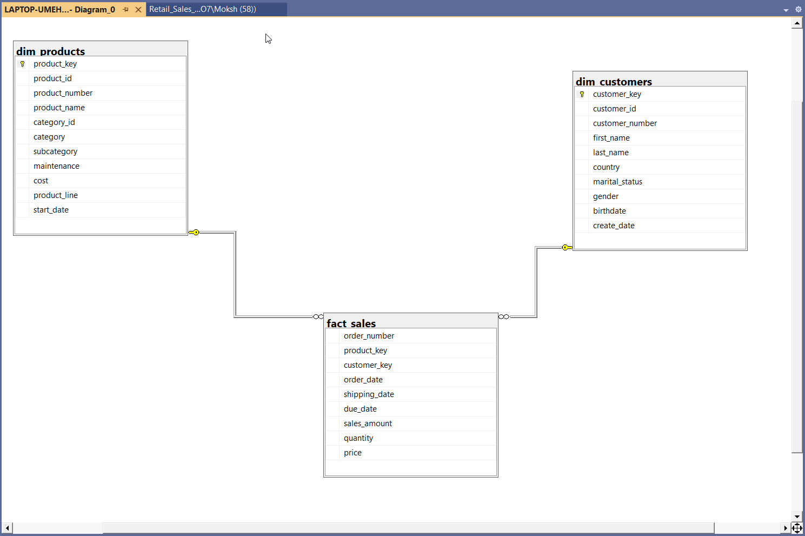

# 🛒 Retail Sales Analytics | SQL Project

## 📌 Project Overview
This project focuses on **Exploratory Data Analysis (EDA)** and advanced business insights using SQL.

The objective is to analyze **sales performance, customer behavior, and product trends** to uncover meaningful insights that support data-driven decision-making.

The entire analysis is **SQL-driven**, demonstrating the use of advanced SQL techniques commonly required in Data Analyst roles.

---

## 📊 Dataset Information

The dataset used in this project was **pre-cleaned and structured**.

This project focuses on:
- Data Exploration  
- Analytical Querying  
- Business Insight Generation  

All results and insights are derived directly using SQL queries.

---

## 🗂️ Dataset Description

The dataset consists of three main tables:

- **dim_customers** → Customer information (demographics, location, etc.)
- **dim_products** → Product details (category, cost, etc.)
- **fact_sales** → Transaction-level sales data

---

## 🧩 Data Model

The project follows a **Star Schema**:

- `fact_sales` is the central fact table  
- Connected to:
  - `dim_customers` via `customer_key`
  - `dim_products` via `product_key`

📸 **Schema Diagram:**  


---

## 🗄️ Database Setup

```sql
CREATE DATABASE Retail_Sales_Analytics;
USE Retail_Sales_Analytics;
```

---

## 🔍 Exploratory Data Analysis (EDA)

Performed structured exploration to understand the dataset:

- Retrieved all tables and columns  
- Checked row counts across tables  
- Verified data types  
- Identified NULL and blank values  
- Explored data distribution  

---

## 📊 Key Metrics (KPIs)

Calculated core business metrics:

- Total Sales  
- Total Orders  
- Total Quantity Sold  
- Total Customers  
- Average Selling Price  

---

## 📈 Analysis Performed

### 🔹 Dimension Exploration
- Unique countries, categories, subcategories, and products  

### 🔹 Date Exploration
- Order date range  
- Customer age analysis  

### 🔹 Magnitude Analysis
- Sales by category  
- Customers by country & gender  
- Revenue by customer  

### 🔹 Ranking Analysis
- Top & bottom products by revenue  
- Top customers  
- Lowest order customers  

### 🔹 Change Over Time Analysis
- Monthly and yearly sales trends  

### 🔹 Cumulative Analysis
- Running total of sales  
- Moving average trends  

### 🔹 Performance Analysis
- Year-over-Year (YoY) comparison  
- Product performance vs average  

### 🔹 Part-to-Whole Analysis
- Category contribution to total sales  

### 🔹 Data Segmentation
- Customer segmentation (VIP, Regular, New)  
- Age group segmentation  
- Product cost segmentation  

---

## 🛠️ Skills & SQL Concepts Used

- SQL Joins (INNER, LEFT)  
- Aggregations (SUM, COUNT, AVG)  
- Window Functions (ROW_NUMBER, RANK, DENSE_RANK, LAG)  
- Common Table Expressions (CTEs)  
- Date Functions (YEAR, MONTH, DATEDIFF, FORMAT)  
- CASE Statements  
- View Creation  
- Business Metrics Analysis  
- Customer & Product Segmentation  
- Time-Series & Cumulative Analysis  

---

## 🧾 Reports Created

### 👥 Customer Report
A comprehensive report including:

- Customer segmentation (VIP, Regular, New)  
- Age groups  
- Total orders, sales, and quantity  
- Lifespan  
- Average order value  
- Monthly spend  

📸 **Customer Report Preview:**  


---

### 🛍️ Product Report
A detailed product-level report including:

- Product segmentation (High / Mid / Low performers)  
- Total sales, quantity, and customers  
- Recency analysis  
- Average selling price  
- Monthly revenue  

📸 **Product Report Preview:**  


---

## 🚀 Conclusion

This project demonstrates the ability to transform raw data into actionable insights using SQL.  
It highlights strong analytical thinking, structured querying, and business-focused reporting.

---

## 📁 Project Structure

```
Retail-Sales-Analytics/
│
├── SQL_Scripts/
│   └── project.sql
│
├── images/
│   ├── schema.png
│   ├── customer_report.png
│   └── product_report.png
│
└── README.md
```
## 👤 Author

**Moksh Kapoor**  
Aspiring Data Analyst  

<p>
  🔗 <strong>LinkedIn:</strong> 
  <a href="https://www.linkedin.com/in/moksh-kapoor-618495322/" target="_blank" style="text-decoration:none; color:#0A66C2; font-weight:bold;">
    Visit My LinkedIn Profile
  </a>
</p>

📢 You can also check this project on my LinkedIn post: 
<a href="https://www.linkedin.com/posts/moksh-kapoor-618495322_retail-sales-analytics-sql-based-data-analysis-activity-7442057637980127232-_0ct?utm_source=share&utm_medium=member_desktop&rcm=ACoAAFGVzjQBQzKnpNzkuOZayyyvYW4FkHnrf28" target="_blank">
View Post 🚀
</a>

---

## ⭐ If you found this project useful, consider giving it a star! 🚀
